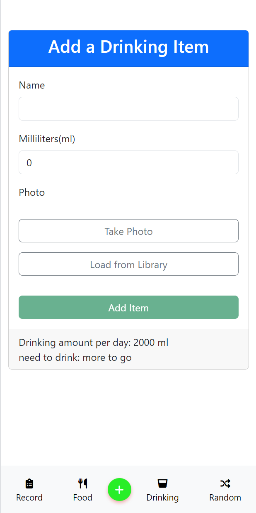

# HealthTrackerApp

HealthTrackerApp is a mobile application developed using the Angular framework and Cordova plugins. This app helps users to track their daily weight, diet, and water intake. Users can add and manage food and drink items, record daily health data, and use various interactive features such as shaking the phone to get random food suggestions.

## Features

- **Daily Record Tracking**: Users can record their daily weight, calorie intake, water intake, and current location.
- **Food Management**: Add, modify, and delete food items with calorie information.
- **Drink Management**: Add, modify, and delete drink items with volume information.
- **Interactive Random Food**: Shake the phone to get random food suggestions.
- **User-Friendly Interface**: Simple and intuitive UI with Bootstrap for a visually appealing design.
- **Photo Functionality**: Capture photos or upload from the library to associate with food and drink items.
- **Location Tracking**: Automatically record the location when adding a daily record.
  
## Screenshots

### All Records

### All Foods

### All Drinking

### Random Food

### Add Daily Record

### Add Food Item

### Add Drinking Item

### Random Food on Shake

### Add Location and Food/Drink

### Add Daily Record with Location

## APK Download

You can download the APK file for the HealthTrackerApp and install it on your Android device:

[Download HealthTrackerApp APK](/app-debug.apk)

## Development

This project was generated with [Angular CLI](https://github.com/angular/angular-cli) version 17.0.9.

### Development server

Run `ng serve` for a dev server. Navigate to `http://localhost:4200/`. The application will automatically reload if you change any of the source files.

### Code scaffolding

Run `ng generate component component-name` to generate a new component. You can also use `ng generate directive|pipe|service|class|guard|interface|enum|module`.

### Build

Run `ng build` to build the project. The build artifacts will be stored in the `dist/` directory.

### Running unit tests

Run `ng test` to execute the unit tests via [Karma](https://karma-runner.github.io).

### Running end-to-end tests

Run `ng e2e` to execute the end-to-end tests via a platform of your choice. To use this command, you need to first add a package that implements end-to-end testing capabilities.

### Further help

To get more help on the Angular CLI use `ng help` or go check out the [Angular CLI Overview and Command Reference](https://angular.io/cli) page.
